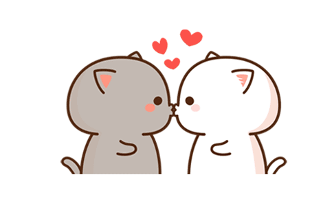
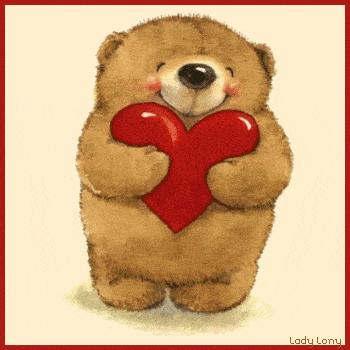

# Amor-de-mi-vida
<html lang="es">
<head>
    <meta charset="UTF-8">
    <meta name="viewport" content="width=device-width, initial-scale=1.0">
    <title>Rompecabezas de Amor</title>
    
</head>
<body>
    

    
Te llegó una carta, ábrela

    

        

        

        

        

        

        

    

    
Gracias por llegar a mi vida 
    y 
    ser lo mejor que me ha pasado, 
    tu alumbras cada uno de mis dias 
    con tu sonrisa y tus ocurrencias, 
    no puedo dejar de pensar en ti 
    la chica mas increible del mundo, 
    eres mi reina hermosa 
    la mujer y la niña de mis ojos 
     
    TE AMO DE AQUI A LA LUNA 
    A PASITOS DE TORTUGA

    
    
    
    
    
    
</body>
</html>
